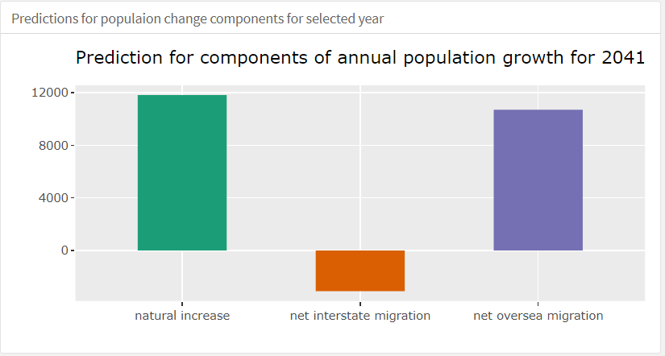
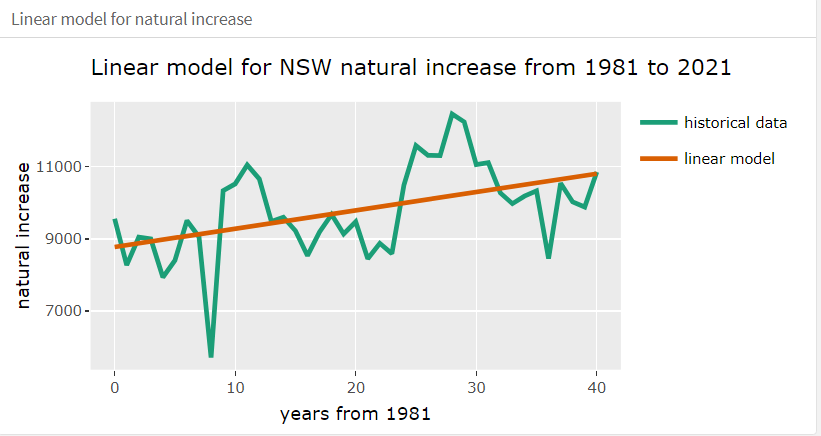
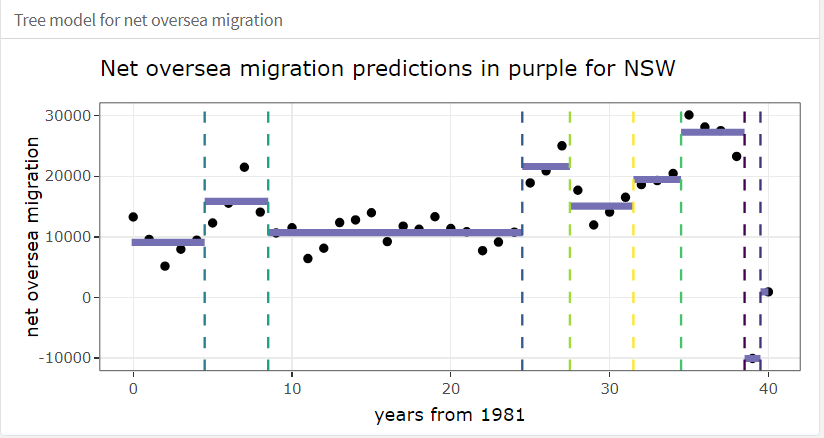
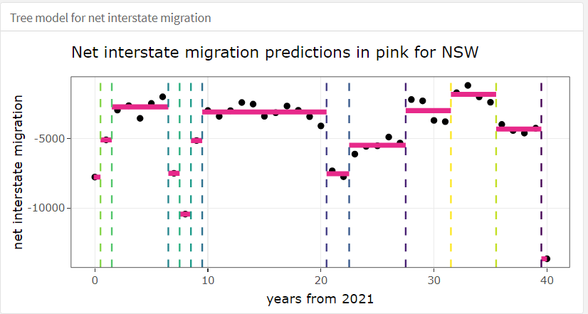

```{r setup, include=FALSE}
knitr::opts_chunk$set(fig.pos = "!H", out.extra = "")
library(flexdashboard)
library(tidyverse)
library(plotly)
library(shiny)
```

```{r global, include=FALSE}

library(readxl)
library(lubridate)

header1 = colnames(read_xlsx("data/au_population_change_by_state.xlsx", sheet = "Data1"))

state_pop_change <- read_xlsx("data/au_population_change_by_state.xlsx", 
                       sheet = "Data1",range = cell_limits(c(11,1)),
                       col_names = header1) %>%
  rename(Quarter = `...1`) %>%
  mutate(Quarter = ymd(Quarter))

NSW_pop <- state_pop_change %>% select(`Quarter`,
         `Natural Increase ;  New South Wales ;`,
         `Net Overseas Migration ;  New South Wales ;`,
         `Net Interstate Migration ;  New South Wales ;`) %>%
  rename(natural_increase = `Natural Increase ;  New South Wales ;`,
         net_oversea = `Net Overseas Migration ;  New South Wales ;`,
         net_interstate = `Net Interstate Migration ;  New South Wales ;`) %>%
  mutate(state = "NSW")%>%
  mutate(year = year(Quarter),
         month = month(Quarter)) %>%
  filter(month == "9") %>%
  select(year, month, natural_increase,net_oversea,net_interstate) %>% 
  mutate(year1981 = year-1981)

VIC_pop <- state_pop_change %>% select( `Quarter`,
         `Natural Increase ;  Victoria ;`,
         `Net Overseas Migration ;  Victoria ;`,
         `Net Interstate Migration ;  Victoria ;`) %>%
  rename(natural_increase = `Natural Increase ;  Victoria ;`,
         net_oversea = `Net Overseas Migration ;  Victoria ;`,
         net_interstate = `Net Interstate Migration ;  Victoria ;`) %>%
  mutate(state = "VIC") %>%
  mutate(year = year(Quarter),
         month = month(Quarter)) %>%
  filter(month == "9") %>%
  select(year, month, natural_increase,net_oversea,net_interstate)%>% 
  mutate(year1981 = year-1981)

QSL_pop <- state_pop_change %>% select( `Quarter`,
         `Natural Increase ;  Queensland ;`,
         `Net Overseas Migration ;  Queensland ;`,
         `Net Interstate Migration ;  Queensland ;`) %>%
  rename(natural_increase = `Natural Increase ;  Queensland ;`,
         net_oversea = `Net Overseas Migration ;  Queensland ;`,
         net_interstate = `Net Interstate Migration ;  Queensland ;`) %>%
  mutate(state = "QSL") %>%
  mutate(year = year(Quarter),
         month = month(Quarter)) %>%
  filter(month == "9") %>%
  select(year, month, natural_increase,net_oversea,net_interstate)%>% 
  mutate(year1981 = year-1981)

WA_pop <- state_pop_change %>% select(`Quarter`,
         `Natural Increase ;  Western Australia ;`,
         `Net Overseas Migration ;  Western Australia ;`,
         `Net Interstate Migration ;  Western Australia ;`) %>%
  rename(natural_increase = `Natural Increase ;  Western Australia ;`,
         net_oversea = `Net Overseas Migration ;  Western Australia ;`,
         net_interstate = `Net Interstate Migration ;  Western Australia ;`) %>%
  mutate(state = "WA") %>%
  mutate(year = year(Quarter),
         month = month(Quarter)) %>%
  filter(month == "9") %>%
  select(year, month, natural_increase,net_oversea,net_interstate)%>% 
  mutate(year1981 = year-1981)


NSW <- NSW_pop %>%
  mutate(state = "NSW") %>%
  select(year, natural_increase, net_oversea, net_interstate, state)

VIC <- VIC_pop %>%
  mutate(state = "VIC") %>%
  select(year, natural_increase, net_oversea, net_interstate, state)

QSL <- QSL_pop %>%
  mutate(state = "QSL") %>%
  select(year, natural_increase, net_oversea, net_interstate, state)

WA <- WA_pop %>%
  mutate(state = "WA") %>%
  select(year, natural_increase, net_oversea, net_interstate, state)

state_pop <- bind_rows(NSW, VIC, QSL, WA) %>% arrange(year) %>%
  gather(components, net_change, -year, -state)

```

```{r natural increase model plot}

library(broom)
library(purrr)

NSW_natural_fit <- lm(natural_increase~year1981, data = NSW_pop)
NSW_natural_model <- augment(NSW_natural_fit, data = NSW_pop)

# Fitting the estimated model over the data
NSW_p1 <- ggplot(NSW_natural_model, aes(x=year1981, y=natural_increase))+
  geom_line(aes(color = "historical data"),size=1)+
  geom_line(aes(y=.fitted, color = "linear model"),size =1) +
  labs(title = "Linear model for NSW natural increase from 1981 to 2021",
       x = "years from 1981",
       y = "natural increase",
       color = "") +
  scale_color_brewer(palette = "Dark2")+
  theme(legend.position = "bottom")


VIC_natural_fit <- lm(natural_increase~year1981, data = VIC_pop)
VIC_natural_model <- augment(VIC_natural_fit, data = VIC_pop)

VIC_p1 <- ggplot(VIC_natural_model, aes(x=year1981, y=natural_increase))+
  geom_line(aes(color = "historical data"),size=1)+
  geom_line(aes(y=.fitted, color = "linear model"),size =1) +
  labs(title = "Linear model for VIC natural increase from 1981 to 2021",
       x = "years from 1981",
       y = "natural increase",
       color = "") +
  scale_color_brewer(palette = "Dark2")+
  theme(legend.position = "bottom")


QSL_natural_fit <- lm(natural_increase~year1981, data = QSL_pop)
QSL_natural_model <- augment(QSL_natural_fit, data = QSL_pop)

QSL_p1 <- ggplot(QSL_natural_model, aes(x=year1981, y=natural_increase))+
  geom_line(aes(color = "historical data"),size=1)+
  geom_line(aes(y=.fitted, color = "linear model"),size =1) +
  labs(title = "Linear model for QSL natural increase from 1981 to 2021",
       x = "years from 1981",
       y = "natural increase",
       color = "") +
  scale_color_brewer(palette = "Dark2")+
  theme(legend.position = "bottom")


WA_natural_fit <- lm(natural_increase~year1981, data = WA_pop)
WA_natural_model <- augment(WA_natural_fit, data = WA_pop)

WA_p1 <- ggplot(WA_natural_model, aes(x=year1981, y=natural_increase))+
  geom_line(aes(color = "historical data"),size=1)+
  geom_line(aes(y=.fitted, color = "linear model"),size =1) +
  labs(title = "Linear model for WA natural increase from 1981 to 2021",
       x = "years from 1981",
       y = "natural increase",
       color = "") +
  scale_color_brewer(palette = "Dark2")+
  theme(legend.position = "bottom")

```


```{r tree model oversea NSW}
library(rpart)
oversea_NSW_rp <- rpart(net_oversea~year1981, data = NSW_pop, control = rpart.control(minsplit = 2))

splt_NSW_oversea <- as_tibble(oversea_NSW_rp$splits)
splt_NSW_oversea <- splt_NSW_oversea %>%
  mutate(order = 1:nrow(splt_NSW_oversea)) %>%
  select(index, order)

# Create split 
buckets_NSW <- NSW_pop %>% 
  mutate(bucket = cut(year1981, breaks=c(min(year1981)-0.1, splt_NSW_oversea$index, max(year1981)))) 

# Prediction between lower and upper bound of split (reg tree pred: mean of y)
oversea_NSW_pred <- buckets_NSW %>% 
  group_by(bucket) %>% 
  mutate(pred = mean(net_oversea)) %>% 
  arrange(year1981) %>% 
  separate(bucket, into = c("lower", "upper"), sep = ",") %>% 
  mutate(lower = as.numeric(str_remove_all(lower, "[(]")), upper = as.numeric(str_remove_all(upper, "\\]"))) %>% 
  select(pred, lower, upper) %>% 
  distinct() %>% 
  gather("boundaries", "year1981", 2:3)


# Prediction from regression tree
NSW_p2 <- ggplot(NSW_pop) + 
  geom_point(aes(x=year1981, y=net_oversea)) + 
  geom_line(data=oversea_NSW_pred, aes(x=year1981, y=pred, group=pred), colour="#7570B3", size=1.5) + 
  geom_vline(data=splt_NSW_oversea, aes(xintercept = index, colour=factor(order)), linetype=2) + 
  labs(title = "Net oversea migration predictions in purple for NSW",
       subtitle = "based on regression tree model",
       x = 'years from 1981', y = "net oversea migration") + 
  scale_colour_viridis_d() + theme_bw() + 
  theme(legend.position="none")


```

```{r tree model oversea VIC}
oversea_VIC_rp <- rpart(net_oversea~year1981, data = VIC_pop, control = rpart.control(minsplit = 2))

splt_VIC_oversea <- as_tibble(oversea_VIC_rp$splits)
splt_VIC_oversea <- splt_VIC_oversea %>%
  mutate(order = 1:nrow(splt_VIC_oversea)) %>%
  select(index, order)

# Create split 
buckets_VIC <- VIC_pop %>% 
  mutate(bucket = cut(year1981, breaks=c(min(year1981)-0.1, splt_VIC_oversea$index, max(year1981)))) 

# Prediction between lower and upper bound of split (reg tree pred: mean of y)
oversea_VIC_pred <- buckets_VIC %>% 
  group_by(bucket) %>% 
  mutate(pred = mean(net_oversea)) %>% 
  arrange(year1981) %>% 
  separate(bucket, into = c("lower", "upper"), sep = ",") %>% 
  mutate(lower = as.numeric(str_remove_all(lower, "[(]")), upper = as.numeric(str_remove_all(upper, "\\]"))) %>% 
  select(pred, lower, upper) %>% 
  distinct() %>% 
  gather("boundaries", "year1981", 2:3)


# Prediction from regression tree
VIC_p2 <- ggplot(VIC_pop) + 
  geom_point(aes(x=year1981, y=net_oversea)) + 
  geom_line(data=oversea_VIC_pred, aes(x=year1981, y=pred, group=pred), colour="#7570B3", size=1.5) + 
  geom_vline(data=splt_VIC_oversea, aes(xintercept = index, colour=factor(order)), linetype=2) + 
  labs(title = "Net oversea migration predictions in purple for VIC",
       subtitle = "based on regression tree model",
       x = 'years from 1981', y = "net oversea migration") + 
  scale_colour_viridis_d() + theme_bw() + 
  theme(legend.position="none")


```


```{r tree model oversea QSL}

oversea_QSL_rp <- rpart(net_oversea~year1981, data = QSL_pop, control = rpart.control(minsplit = 2))

splt_QSL_oversea <- as_tibble(oversea_QSL_rp$splits)
splt_QSL_oversea <- splt_QSL_oversea %>%
  mutate(order = 1:nrow(splt_QSL_oversea)) %>%
  select(index, order)

# Create split 
buckets_QSL <- QSL_pop %>% 
  mutate(bucket = cut(year1981, breaks=c(min(year1981)-0.1, splt_QSL_oversea$index, max(year1981)))) 

# Prediction between lower and upper bound of split (reg tree pred: mean of y)
oversea_QSL_pred <- buckets_QSL %>% 
  group_by(bucket) %>% 
  mutate(pred = mean(net_oversea)) %>% 
  arrange(year1981) %>% 
  separate(bucket, into = c("lower", "upper"), sep = ",") %>% 
  mutate(lower = as.numeric(str_remove_all(lower, "[(]")), upper = as.numeric(str_remove_all(upper, "\\]"))) %>% 
  select(pred, lower, upper) %>% 
  distinct() %>% 
  gather("boundaries", "year1981", 2:3)


# Prediction from regression tree
QSL_p2 <- ggplot(QSL_pop) + 
  geom_point(aes(x=year1981, y=net_oversea)) + 
  geom_line(data=oversea_QSL_pred, aes(x=year1981, y=pred, group=pred), colour="#7570B3", size=1.5) + 
  geom_vline(data=splt_QSL_oversea, aes(xintercept = index, colour=factor(order)), linetype=2) + 
  labs(title = "Net oversea migration predictions in purple for QSL",
       subtitle = "based on regression tree model",
       x = 'years from 1981', y = "net oversea migration") + 
  scale_colour_viridis_d() + theme_bw() + 
  theme(legend.position="none")


```


```{r tree model oversea WA}
oversea_WA_rp <- rpart(net_oversea~year1981, data = WA_pop, control = rpart.control(minsplit = 2))

splt_WA_oversea <- as_tibble(oversea_WA_rp$splits)
splt_WA_oversea <- splt_WA_oversea %>%
  mutate(order = 1:nrow(splt_WA_oversea)) %>%
  select(index, order)

# Create split 
buckets_WA <- WA_pop %>% 
  mutate(bucket = cut(year1981, breaks=c(min(year1981)-0.1, splt_WA_oversea$index, max(year1981)))) 

# Prediction between lower and upper bound of split (reg tree pred: mean of y)
oversea_WA_pred <- buckets_WA %>% 
  group_by(bucket) %>% 
  mutate(pred = mean(net_oversea)) %>% 
  arrange(year1981) %>% 
  separate(bucket, into = c("lower", "upper"), sep = ",") %>% 
  mutate(lower = as.numeric(str_remove_all(lower, "[(]")), upper = as.numeric(str_remove_all(upper, "\\]"))) %>% 
  select(pred, lower, upper) %>% 
  distinct() %>% 
  gather("boundaries", "year1981", 2:3)


# Prediction from regression tree
WA_p2 <- ggplot(WA_pop) + 
  geom_point(aes(x=year1981, y=net_oversea)) + 
  geom_line(data=oversea_WA_pred, aes(x=year1981, y=pred, group=pred), colour="#7570B3", size=1.5) + 
  geom_vline(data=splt_WA_oversea, aes(xintercept = index, colour=factor(order)), linetype=2) + 
  labs(title = "Net oversea migration predictions in purple for WA",
       subtitle = "based on regression tree model",
       x = 'years from 1981', y = "net oversea migration") + 
  scale_colour_viridis_d() + theme_bw() + 
  theme(legend.position="none")

```

```{r tree model interstate NSW}

interstate_NSW_rp <- rpart(net_interstate~year1981, data = NSW_pop, control = rpart.control(minsplit = 2))

splt_NSW_interstate <- as_tibble(interstate_NSW_rp$splits)
splt_NSW_interstate <- splt_NSW_interstate %>%
  mutate(order = 1:nrow(splt_NSW_interstate)) %>%
  select(index, order)


# Create split 
int_buckets_NSW <- NSW_pop %>% 
  mutate(bucket = cut(year1981, breaks=c(min(year1981)-0.1, splt_NSW_interstate$index, max(year1981)))) 

# Prediction between lower and upper bound of split (reg tree pred: mean of y)
interstate_NSW_pred <- int_buckets_NSW %>% 
  group_by(bucket) %>% 
  mutate(pred = mean(net_interstate)) %>% 
  arrange(year1981) %>% 
  separate(bucket, into = c("lower", "upper"), sep = ",") %>% 
  mutate(lower = as.numeric(str_remove_all(lower, "[(]")), upper = as.numeric(str_remove_all(upper, "\\]"))) %>% 
  select(pred, lower, upper) %>% 
  distinct() %>% 
  gather("boundaries", "year1981", 2:3)

# Prediction from regression tree
NSW_p3 <- ggplot(NSW_pop) + 
  geom_point(aes(x=year1981, y=net_interstate)) + 
  geom_line(data=interstate_NSW_pred, aes(x=year1981, y=pred, group=pred), colour="#E7298A", size=1.5) + 
  geom_vline(data=splt_NSW_interstate, aes(xintercept = index, colour=factor(order)), linetype=2) + 
  labs(title = "Net interstate migration predictions in pink for NSW",
       x = 'years from 1981', y = "net interstate migration",
       caption = "R^2 = 0.9682") + 
  scale_colour_viridis_d() + theme_bw() + 
  theme(legend.position="none")


```

```{r tree model interstate VIC}

interstate_VIC_rp <- rpart(net_interstate~year1981, data = VIC_pop, control = rpart.control(minsplit = 2))

splt_VIC_interstate <- as_tibble(interstate_VIC_rp$splits)
splt_VIC_interstate <- splt_VIC_interstate %>%
  mutate(order = 1:nrow(splt_VIC_interstate)) %>%
  select(index, order)


# Create split 
int_buckets_VIC <- VIC_pop %>% 
  mutate(bucket = cut(year1981, breaks=c(min(year1981)-0.1, splt_VIC_interstate$index, max(year1981)))) 

# Prediction between lower and upper bound of split (reg tree pred: mean of y)
interstate_VIC_pred <- int_buckets_VIC %>% 
  group_by(bucket) %>% 
  mutate(pred = mean(net_interstate)) %>% 
  arrange(year1981) %>% 
  separate(bucket, into = c("lower", "upper"), sep = ",") %>% 
  mutate(lower = as.numeric(str_remove_all(lower, "[(]")), upper = as.numeric(str_remove_all(upper, "\\]"))) %>% 
  select(pred, lower, upper) %>% 
  distinct() %>% 
  gather("boundaries", "year1981", 2:3)

# Prediction from regression tree
VIC_p3 <- ggplot(VIC_pop) + 
  geom_point(aes(x=year1981, y=net_interstate)) + 
  geom_line(data=interstate_VIC_pred, aes(x=year1981, y=pred, group=pred), colour="#E7298A", size=1.5) + 
  geom_vline(data=splt_VIC_interstate, aes(xintercept = index, colour=factor(order)), linetype=2) + 
  labs(title = "Net interstate migration predictions in pink for VIC",
       x = 'years from 1981', y = "net interstate migration",
       caption = "R^2 = 0.9682") + 
  scale_colour_viridis_d() + theme_bw() + 
  theme(legend.position="none")


```


```{r tree model interstate QSL}

interstate_QSL_rp <- rpart(net_interstate~year1981, data = QSL_pop, control = rpart.control(minsplit = 2))

splt_QSL_interstate <- as_tibble(interstate_QSL_rp$splits)
splt_QSL_interstate <- splt_QSL_interstate %>%
  mutate(order = 1:nrow(splt_QSL_interstate)) %>%
  select(index, order)


# Create split 
int_buckets_QSL <- QSL_pop %>% 
  mutate(bucket = cut(year1981, breaks=c(min(year1981)-0.1, splt_QSL_interstate$index, max(year1981)))) 

# Prediction between lower and upper bound of split (reg tree pred: mean of y)
interstate_QSL_pred <- int_buckets_QSL %>% 
  group_by(bucket) %>% 
  mutate(pred = mean(net_interstate)) %>% 
  arrange(year1981) %>% 
  separate(bucket, into = c("lower", "upper"), sep = ",") %>% 
  mutate(lower = as.numeric(str_remove_all(lower, "[(]")), upper = as.numeric(str_remove_all(upper, "\\]"))) %>% 
  select(pred, lower, upper) %>% 
  distinct() %>% 
  gather("boundaries", "year1981", 2:3)

# Prediction from regression tree
QSL_p3 <- ggplot(QSL_pop) + 
  geom_point(aes(x=year1981, y=net_interstate)) + 
  geom_line(data=interstate_QSL_pred, aes(x=year1981, y=pred, group=pred), colour="#E7298A", size=1.5) + 
  geom_vline(data=splt_QSL_interstate, aes(xintercept = index, colour=factor(order)), linetype=2) + 
  labs(title = "Net interstate migration predictions in pink for QSL",
       x = 'years from 1981', y = "net interstate migration",
       caption = "R^2 = 0.9682") + 
  scale_colour_viridis_d() + theme_bw() + 
  theme(legend.position="none")


```


```{r tree model interstate WA}

interstate_WA_rp <- rpart(net_interstate~year1981, data = WA_pop, control = rpart.control(minsplit = 2))

splt_WA_interstate <- as_tibble(interstate_WA_rp$splits)
splt_WA_interstate <- splt_WA_interstate %>%
  mutate(order = 1:nrow(splt_WA_interstate)) %>%
  select(index, order)


# Create split 
int_buckets_WA <- WA_pop %>% 
  mutate(bucket = cut(year1981, breaks=c(min(year1981)-0.1, splt_WA_interstate$index, max(year1981)))) 

# Prediction between lower and upper bound of split (reg tree pred: mean of y)
interstate_WA_pred <- int_buckets_WA %>% 
  group_by(bucket) %>% 
  mutate(pred = mean(net_interstate)) %>% 
  arrange(year1981) %>% 
  separate(bucket, into = c("lower", "upper"), sep = ",") %>% 
  mutate(lower = as.numeric(str_remove_all(lower, "[(]")), upper = as.numeric(str_remove_all(upper, "\\]"))) %>% 
  select(pred, lower, upper) %>% 
  distinct() %>% 
  gather("boundaries", "year1981", 2:3)

# Prediction from regression tree
WA_p3 <- ggplot(WA_pop) + 
  geom_point(aes(x=year1981, y=net_interstate)) + 
  geom_line(data=interstate_WA_pred, aes(x=year1981, y=pred, group=pred), colour="#E7298A", size=1.5) + 
  geom_vline(data=splt_WA_interstate, aes(xintercept = index, colour=factor(order)), linetype=2) + 
  labs(title = "Net interstate migration predictions in pink for WA",
       x = 'years from 1981', y = "net interstate migration",
       caption = "R^2 = 0.9682") + 
  scale_colour_viridis_d() + theme_bw() + 
  theme(legend.position="none")

```


```{r future analysis NSW}

years1 = c(41:80)

# NSW natural prediction
future_NSW_natural <- predict(NSW_natural_fit, data.frame(year1981 = years1))

future_NSW_natural_df <- data.frame(year2021 = years1-40,
           natural_increase = future_NSW_natural)

years2 = c(1:40)

# NSW net oversea prediction

future_NSW_oversea <- predict(oversea_NSW_rp, data.frame(year1981 = years2))

future_NSW_oversea_df <- data.frame(year2021 = years2,
           net_oversea = future_NSW_oversea)


# NSW net interstate prediction

future_NSW_interstate <- predict(interstate_NSW_rp, data.frame(year1981 = years2))

future_NSW_interstate_df <- data.frame(year2021 = years2,
           net_interstate = future_NSW_interstate)

future_NSW <- left_join(future_NSW_oversea_df,future_NSW_interstate_df, by = "year2021")
future_NSW <- left_join(future_NSW,future_NSW_natural_df,by = 'year2021' )
future_NSW <- future_NSW %>%
  mutate(year = year2021 + 2021) %>%
  select(year, natural_increase, net_oversea, net_interstate)

NSW_2026 <- future_NSW %>%
  filter(year == "2026") %>%
  gather(component, net_change, -year)

NSW_p2026 <- ggplot(NSW_2026,aes(x=component, y=net_change,fill = component))+
  geom_bar(stat = "identity", width = 0.5)+
  scale_fill_brewer(palette = "Dark2")+
  theme(legend.position = "none")+
  scale_x_discrete(labels = c("natural_increase" = "natural increase",
                              "net_oversea" = "net oversea migration",
                              "net_interstate" = "net interstate migration"))+
  labs(title = "Prediction for components of annual population growth for 2026 in NSW",
       x = "", 
       y = "")


NSW_2031 <- future_NSW %>%
  filter(year == "2031") %>%
  gather(component, net_change, -year)

NSW_p2031 <- ggplot(NSW_2031,aes(x=component, y=net_change,fill = component))+
  geom_bar(stat = "identity", width = 0.5)+
  scale_fill_brewer(palette = "Dark2")+
  theme(legend.position = "none")+
  scale_x_discrete(labels = c("natural_increase" = "natural increase",
                              "net_oversea" = "net oversea migration",
                              "net_interstate" = "net interstate migration"))+
  labs(title = "Prediction for components of annual population growth for 2031 in NSW",
       x = "", 
       y = "")


NSW_2041 <- future_NSW %>%
  filter(year == "2041") %>%
  gather(component, net_change, -year)

NSW_p2041 <- ggplot(NSW_2041,aes(x=component, y=net_change,fill = component))+
  geom_bar(stat = "identity", width = 0.5)+
  scale_fill_brewer(palette = "Dark2")+
  theme(legend.position = "none")+
  scale_x_discrete(labels = c("natural_increase" = "natural increase",
                              "net_oversea" = "net oversea migration",
                              "net_interstate" = "net interstate migration"))+
  labs(title = "Prediction for components of annual population growth for 2041 in NSW",
       x = "", 
       y = "")


NSW_2061 <- future_NSW %>%
  filter(year == "2061") %>%
  gather(component, net_change, -year)

NSW_p2061 <- ggplot(NSW_2061,aes(x=component, y=net_change,fill = component))+
  geom_bar(stat = "identity", width = 0.5)+
  scale_fill_brewer(palette = "Dark2")+
  theme(legend.position = "none")+
  scale_x_discrete(labels = c("natural_increase" = "natural increase",
                              "net_oversea" = "net oversea migration",
                              "net_interstate" = "net interstate migration"))+
  labs(title = "Prediction for components of annual population growth for 2061 in NSW",
       x = "", 
       y = "")


```


```{r future analysis VIC}
years1 = c(41:80)

# VIC natural prediction
future_VIC_natural <- predict(VIC_natural_fit, data.frame(year1981 = years1))

future_VIC_natural_df <- data.frame(year2021 = years1-40,
           natural_increase = future_VIC_natural)

years2 = c(1:40)

# VIC net oversea prediction

future_VIC_oversea <- predict(oversea_VIC_rp, data.frame(year1981 = years2))

future_VIC_oversea_df <- data.frame(year2021 = years2,
           net_oversea = future_VIC_oversea)


# VIC net interstate prediction

future_VIC_interstate <- predict(interstate_VIC_rp, data.frame(year1981 = years2))

future_VIC_interstate_df <- data.frame(year2021 = years2,
           net_interstate = future_VIC_interstate)

future_VIC <- left_join(future_VIC_oversea_df,future_VIC_interstate_df, by = "year2021")
future_VIC <- left_join(future_VIC,future_VIC_natural_df,by = 'year2021' )
future_VIC <- future_VIC %>%
  mutate(year = year2021 + 2021) %>%
  select(year, natural_increase, net_oversea, net_interstate)

VIC_2026 <- future_VIC %>%
  filter(year == "2026") %>%
  gather(component, net_change, -year)

VIC_p2026 <- ggplot(VIC_2026,aes(x=component, y=net_change,fill = component))+
  geom_bar(stat = "identity", width = 0.5)+
  scale_fill_brewer(palette = "Dark2")+
  theme(legend.position = "none")+
  scale_x_discrete(labels = c("natural_increase" = "natural increase",
                              "net_oversea" = "net oversea migration",
                              "net_interstate" = "net interstate migration"))+
  labs(title = "Prediction for components of annual population growth for 2026 in VIC",
       x = "", 
       y = "")


VIC_2031 <- future_VIC %>%
  filter(year == "2031") %>%
  gather(component, net_change, -year)

VIC_p2031 <- ggplot(VIC_2031,aes(x=component, y=net_change,fill = component))+
  geom_bar(stat = "identity", width = 0.5)+
  scale_fill_brewer(palette = "Dark2")+
  theme(legend.position = "none")+
  scale_x_discrete(labels = c("natural_increase" = "natural increase",
                              "net_oversea" = "net oversea migration",
                              "net_interstate" = "net interstate migration"))+
  labs(title = "Prediction for components of annual population growth for 2031 in VIC",
       x = "", 
       y = "")


VIC_2041 <- future_VIC %>%
  filter(year == "2041") %>%
  gather(component, net_change, -year)

VIC_p2041 <- ggplot(VIC_2041,aes(x=component, y=net_change,fill = component))+
  geom_bar(stat = "identity", width = 0.5)+
  scale_fill_brewer(palette = "Dark2")+
  theme(legend.position = "none")+
  scale_x_discrete(labels = c("natural_increase" = "natural increase",
                              "net_oversea" = "net oversea migration",
                              "net_interstate" = "net interstate migration"))+
  labs(title = "Prediction for components of annual population growth for 2041 in VIC",
       x = "", 
       y = "")


VIC_2061 <- future_VIC %>%
  filter(year == "2061") %>%
  gather(component, net_change, -year)

VIC_p2061 <- ggplot(VIC_2061,aes(x=component, y=net_change,fill = component))+
  geom_bar(stat = "identity", width = 0.5)+
  scale_fill_brewer(palette = "Dark2")+
  theme(legend.position = "none")+
  scale_x_discrete(labels = c("natural_increase" = "natural increase",
                              "net_oversea" = "net oversea migration",
                              "net_interstate" = "net interstate migration"))+
  labs(title = "Prediction for components of annual population growth for 2061 in VIC",
       x = "", 
       y = "")

```


```{r future analysis QSL}

years1 = c(41:80)

# QSL natural prediction
future_QSL_natural <- predict(QSL_natural_fit, data.frame(year1981 = years1))

future_QSL_natural_df <- data.frame(year2021 = years1-40,
           natural_increase = future_QSL_natural)

years2 = c(1:40)

# QSL net oversea prediction

future_QSL_oversea <- predict(oversea_QSL_rp, data.frame(year1981 = years2))

future_QSL_oversea_df <- data.frame(year2021 = years2,
           net_oversea = future_QSL_oversea)


# QSL net interstate prediction

future_QSL_interstate <- predict(interstate_QSL_rp, data.frame(year1981 = years2))

future_QSL_interstate_df <- data.frame(year2021 = years2,
           net_interstate = future_QSL_interstate)

future_QSL <- left_join(future_QSL_oversea_df,future_QSL_interstate_df, by = "year2021")
future_QSL <- left_join(future_QSL,future_QSL_natural_df,by = 'year2021' )
future_QSL <- future_QSL %>%
  mutate(year = year2021 + 2021) %>%
  select(year, natural_increase, net_oversea, net_interstate)

QSL_2026 <- future_QSL %>%
  filter(year == "2026") %>%
  gather(component, net_change, -year)

QSL_p2026 <- ggplot(QSL_2026,aes(x=component, y=net_change,fill = component))+
  geom_bar(stat = "identity", width = 0.5)+
  scale_fill_brewer(palette = "Dark2")+
  theme(legend.position = "none")+
  scale_x_discrete(labels = c("natural_increase" = "natural increase",
                              "net_oversea" = "net oversea migration",
                              "net_interstate" = "net interstate migration"))+
  labs(title = "Prediction for components of annual population growth for 2026 in QSL",
       x = "", 
       y = "")


QSL_2031 <- future_QSL %>%
  filter(year == "2031") %>%
  gather(component, net_change, -year)

QSL_p2031 <- ggplot(QSL_2031,aes(x=component, y=net_change,fill = component))+
  geom_bar(stat = "identity", width = 0.5)+
  scale_fill_brewer(palette = "Dark2")+
  theme(legend.position = "none")+
  scale_x_discrete(labels = c("natural_increase" = "natural increase",
                              "net_oversea" = "net oversea migration",
                              "net_interstate" = "net interstate migration"))+
  labs(title = "Prediction for components of annual population growth for 2031 in QSL",
       x = "", 
       y = "")


QSL_2041 <- future_QSL %>%
  filter(year == "2041") %>%
  gather(component, net_change, -year)

QSL_p2041 <- ggplot(QSL_2041,aes(x=component, y=net_change,fill = component))+
  geom_bar(stat = "identity", width = 0.5)+
  scale_fill_brewer(palette = "Dark2")+
  theme(legend.position = "none")+
  scale_x_discrete(labels = c("natural_increase" = "natural increase",
                              "net_oversea" = "net oversea migration",
                              "net_interstate" = "net interstate migration"))+
  labs(title = "Prediction for components of annual population growth for 2041 in QSL",
       x = "", 
       y = "")


QSL_2061 <- future_QSL %>%
  filter(year == "2061") %>%
  gather(component, net_change, -year)

QSL_p2061 <- ggplot(QSL_2061,aes(x=component, y=net_change,fill = component))+
  geom_bar(stat = "identity", width = 0.5)+
  scale_fill_brewer(palette = "Dark2")+
  theme(legend.position = "none")+
  scale_x_discrete(labels = c("natural_increase" = "natural increase",
                              "net_oversea" = "net oversea migration",
                              "net_interstate" = "net interstate migration"))+
  labs(title = "Prediction for components of annual population growth for 2061 in QSL",
       x = "", 
       y = "")


```


```{r future analysis WA}
years1 = c(41:80)

# WA natural prediction
future_WA_natural <- predict(WA_natural_fit, data.frame(year1981 = years1))

future_WA_natural_df <- data.frame(year2021 = years1-40,
           natural_increase = future_WA_natural)

years2 = c(1:40)

# WA net oversea prediction

future_WA_oversea <- predict(oversea_WA_rp, data.frame(year1981 = years2))

future_WA_oversea_df <- data.frame(year2021 = years2,
           net_oversea = future_WA_oversea)


# WA net interstate prediction

future_WA_interstate <- predict(interstate_WA_rp, data.frame(year1981 = years2))

future_WA_interstate_df <- data.frame(year2021 = years2,
           net_interstate = future_WA_interstate)

future_WA <- left_join(future_WA_oversea_df,future_WA_interstate_df, by = "year2021")
future_WA <- left_join(future_WA,future_WA_natural_df,by = 'year2021' )
future_WA <- future_WA %>%
  mutate(year = year2021 + 2021) %>%
  select(year, natural_increase, net_oversea, net_interstate)

WA_2026 <- future_WA %>%
  filter(year == "2026") %>%
  gather(component, net_change, -year)

WA_p2026 <- ggplot(WA_2026,aes(x=component, y=net_change,fill = component))+
  geom_bar(stat = "identity", width = 0.5)+
  scale_fill_brewer(palette = "Dark2")+
  theme(legend.position = "none")+
  scale_x_discrete(labels = c("natural_increase" = "natural increase",
                              "net_oversea" = "net oversea migration",
                              "net_interstate" = "net interstate migration"))+
  labs(title = "Prediction for components of annual population growth for 2026 in WA",
       x = "", 
       y = "")


WA_2031 <- future_WA %>%
  filter(year == "2031") %>%
  gather(component, net_change, -year)

WA_p2031 <- ggplot(WA_2031,aes(x=component, y=net_change,fill = component))+
  geom_bar(stat = "identity", width = 0.5)+
  scale_fill_brewer(palette = "Dark2")+
  theme(legend.position = "none")+
  scale_x_discrete(labels = c("natural_increase" = "natural increase",
                              "net_oversea" = "net oversea migration",
                              "net_interstate" = "net interstate migration"))+
  labs(title = "Prediction for components of annual population growth for 2031 in WA",
       x = "", 
       y = "")


WA_2041 <- future_WA %>%
  filter(year == "2041") %>%
  gather(component, net_change, -year)

WA_p2041 <- ggplot(WA_2041,aes(x=component, y=net_change,fill = component))+
  geom_bar(stat = "identity", width = 0.5)+
  scale_fill_brewer(palette = "Dark2")+
  theme(legend.position = "none")+
  scale_x_discrete(labels = c("natural_increase" = "natural increase",
                              "net_oversea" = "net oversea migration",
                              "net_interstate" = "net interstate migration"))+
  labs(title = "Prediction for components of annual population growth for 2041 in WA",
       x = "", 
       y = "")


WA_2061 <- future_WA %>%
  filter(year == "2061") %>%
  gather(component, net_change, -year)

WA_p2061 <- ggplot(WA_2061,aes(x=component, y=net_change,fill = component))+
  geom_bar(stat = "identity", width = 0.5)+
  scale_fill_brewer(palette = "Dark2")+
  theme(legend.position = "none")+
  scale_x_discrete(labels = c("natural_increase" = "natural increase",
                              "net_oversea" = "net oversea migration",
                              "net_interstate" = "net interstate migration"))+
  labs(title = "Prediction for components of annual population growth for 2061 in WA",
       x = "", 
       y = "")


```


Predictions
=========================================================================

Column {.sidebar data-width=200}
-----------------------------------------------------------------------

```{r selectinputs}
selectInput("state", label = "State:",
            choices = c("New South Wales"= "NSW", 
                        "Victoria" = "VIC",
                        "Queensland" = "QSL",
                        "Western Australia" = "WA"))

selectInput("pred_year", label = "Year of prediction:",
            choices = c("2026 (5 years later)" = "p2026",
                        "2031 (10 years later)" = "p2031",
                        "2041 (20 years later)" = "p2041",
                        "2061 (40 years later)" = "p2061"))


```


Column {data-width=550}
-----------------------------------------------------------------------

### Predictions for populaion change components for selected year

```{r plot prediction for components}

renderPlotly({
  get(paste(input$state,input$pred_year,sep = "_"))
})


```

### Linear model for natural increase

```{r plot linear model natural increase}

renderPlotly({
  get(paste(input$state,"_p1",sep = ""))
})

```


Column {data-width=550}
-----------------------------------------------------------------------

### Tree model for net oversea migration

```{r plot tree model net oversea}

renderPlotly({
  get(paste(input$state,"_p2",sep = ""))
})

```

### Tree model for net interstate migration

```{r plot tree model for net interstate}

renderPlotly({
  get(paste(input$state,"_p3",sep = ""))
})

```


Data
============================================================================

Row {data-height=330}
-------------------------------------------------------------------------------

### Data source

Australian states’ **annual population change** has three components:

1.	Natural increase – births minus deaths 
2.	Net overseas migration (oversea migration arrivals minus oversea migration departures) 
3.	Net interstate migration (interstate migration arrivals minus interstate migration departures)

The dataset used here is from the “Australian Bureau of Statistics” website: Components of population change – state and territories. 


<https://www.abs.gov.au/statistics/people/population/national-state-and-territory-population/latest-release#methodology>


Row {data-height=670}
--------------------------------------------------------------------------------------

### Data Wrangling

The original dataset shows `Natural increase`, `Net Oversea Migration`, `Net Interstate Migration` and `Change Over Previous Quarter` for all 8 states in Australia from year 1981 to 2021. 

The dataset is cleaned and wrangled by the following steps:

1. Natural increase, Net oversea migration and Net interstate migration for states New South Wales, Victoria, Queensland and Western Australia are gathered respectively from the original xlsx file. 
2. Add a column variable `state` for each state, for example add a column with name `state` and value of "VIC" for Victoria's dataframe. 
3. Combine the 4 dataframes using `bind_rows()` function
4. Convert the data into clean data format using `gather()`function 

The first 5 rows of cleaned dataset is as follows with variables: 

- `year`: the year of the population change recorded 
- `state`: state abbreviation 
- `components`: components of annual population change - natural increase, net oversea migration or net interstate migration 
- `net_change`: figures for each component of annual population change 

```{r}
head(state_pop, 5)
```


Models
============================================================================

Row
-------------------------------------------------------------------------------
### Natural increase

Simple linear regression model is used for annual natural increase prediction, while tree regression model is used for annual net interstate and oversea migration predictions.

Because the annual natural increase for each state was relatively stable than their annual net oversea and interstate migration figures, which can be seen from the historical data plots.

**Linear regression Model** for natural increase:
$$
y = \beta_0+\beta_1 year1981 + \epsilon
$$
where `year1981` is a re-scaled `year` variable, which indicates how many years after 1981 are we predicting.

**Assumption for prediction**: the assumption to predict future annual natural increase for the 4 states based on the linear model here is that the growth rate of the natural increase will be stable and no extreme situation like severe natural disaster or government restrains on birth rates will happen in the future.


### Historical data for four states

```{r}
state_pop %>%
  group_by(components) %>%
  ggplot(aes(x=year, y=net_change, color = components))+
  geom_line(size = 0.8)+
  facet_wrap(~state, nrow = 3)+
  theme(legend.position = "bottom")+
  labs(title = "Components of population change",
       x = "year (1981-2021)")+
  theme(axis.title.y = element_blank(), legend.title = element_blank())+
  scale_color_brewer(palette = "Dark2")

```


Row
------------------------------------------------------------------------------------------
### Net oversea and interstate migration

**Tree regression Model** for net oversea and interstate migration:


A regression tree is a machine-learning algorithm that predicts a response variable by learning decision rules from the explanatory variables. 

Here we use regression tree to divide net oversea and interstate migration data into subsets of similar values, and estimating the response within each subset. 

The division into subsets happens only on single variables - years from 1981. The estimate of the response variable is the average value in the subset.

The regression tree for example for New South Wales net oversea migration is shown on the right.

**Assumption for prediction**: the assumption of the prediction for future net oversea and interstate migration figures based on this tree regression model is that the pattern of their changes in the following 40 years will be exactly the same as their patterns from year 1981 to 2021.

### Regression tree sample

```{r}
library(rpart.plot)
rpart.plot(oversea_NSW_rp)

```


Tutorial
============================================================================

Row {data-height=400}
-------------------------------------------------------------------------------
### Simulating population change components for future years

On the **Predictions** page, there are four plots showing:

- prediction for population change components in future years based on the models explained in the **Models** page: 
- fitted linear model for annual natural increase of the state selected from year 1981 to 2021 
- fitted tree regression model for annual net oversea migration of the state selected from year 1981 to 2021 
- fitted tree regression model for annual net interstate migration of the state selected from year 1981 to 2021 

the left sidebar shows two tabs for selection. While the **State** tab allows us to visualize the fitted models for selected state, the **Year of prediction** tab enables us to simulate the future year population change components for the state selected.

The following example is when "New South Wales" and "2041 (20 years later)" are selected.

Row {data-height=600}
-----------------------------------------------------------------------------------------
### prediction for future population change components of NSW in year 2041



### fitted linear model for annual natural increase of NSW



### fitted tree regression model for annual net oversea migration of NSW



### fitted tree regression model for annual net interstate migration of NSW




Disclaimer
============================================================================

This simulation is for research and educational purposes only and is not intended to be a tool for decision-making. 

The data collected from Australian Burea of Statistics is adjusted to incorporate the most accurate data due to many reasons such as births or deaths that occurred in the target quarter and are registered from 3 to 6 quarters later (which impact the accuracy of natural increase figures) or the widespread updating of Medicare records as people get vaccinated for COVID-19 (which impact the accuracy of interstate migration figures).

According to ABS, it collects statistical information under the authority of the Census and Statistics Act, 1905, which requires that statistical output shall not be published or disseminated in a manner that is likely to enable the identification of a particular person or organisation.

Thus sensitive data cells may be suppressed are marked as not available for publication but are included in totals where applicable. In these cases, data may not sum to totals.

Moreover, the linear regression and tree regression model used here for prediction is also based on many assumptions, which is explained in the Models page.


**References**


Australian Bureau of Statistics. *National, state and territory population methodology*. Retrieved from <https://www.abs.gov.au/methodologies/national-state-and-territory-population-methodology/sep-2021#overseas-migration>


